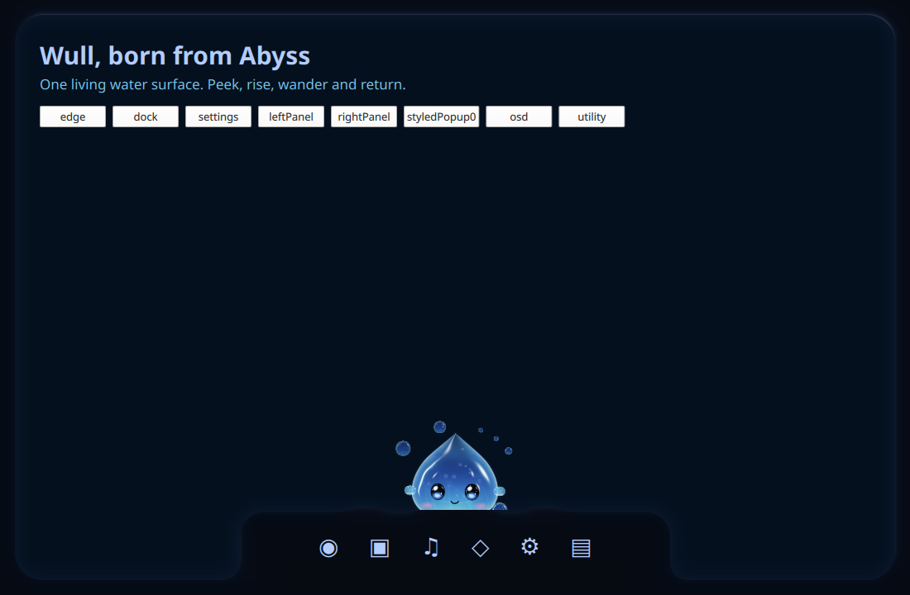
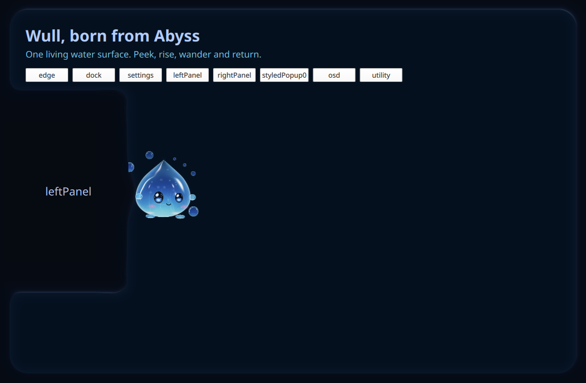
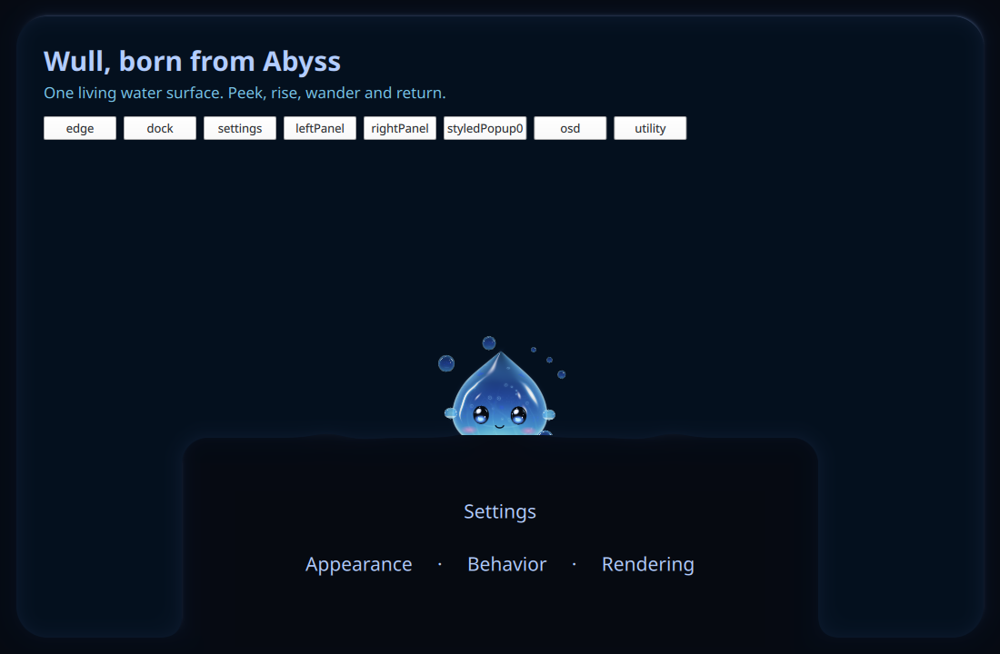

# Wull, born from Abyss

Shared-water feature source: `16e6122951f17753341c9db0dc49b707837de6ef`. Painted-capacity guard: `eb47aa88d`; historical/click regression repair: `2f01fbadf032c249750b0b14678fa4462a8ebbe8`; shared input and final runtime source: `901e98864157211dd8a857e320efc5c1ac041d20`, branch `dev`. AI implementation remains deferred.

Wull's peek, emergence and dive deform the same Abyss field that draws the screen edges and connected bodies. A small liquid neck follows Wull's existing presentation; two traveling crests spread along the contact boundary and catch the field's own specular light. Depart, land and tap also disturb that water. The production host no longer overlays separate emergence rings. The local impulse lasts 1,450 ms and settles completely. With global Abyss waves enabled, it also feeds the existing circular Popup/Sidebar solver through the parent screen edge. Local contact honors Companion effects/motion; policy, backend or capacity loss cancels it immediately.

All registered, settled Abyss bodies become eligible habitats: Dock, Settings, both Sidebars, ordinary and styled popup/IPC hosts, OSD, notifications, dashboard/controls, clipboard, auxiliary and utility surfaces. New body-host owners join through the same registry. Contacts use actual painted `geometry.surface`, excluding inset content/input bounds. Moving bodies remain obstacles until content and geometry settle. Full host clearance and the field's drawn-record capacity remain authoritative. A full-screen Settings body with no clear rim does not force an overlapping appearance. Modal/security ownership still takes precedence.

Walking needs a continuous horizontal rim wide enough for the entire scaled host, excluding rounded corners. Vertical edges and unsupported travel use Float. Normal hide chooses the nearest reachable body-water rim or screen edge and dives there. Dock holds open during a visit, an arrival or the final dive; the hold reads semantic placement and releases when the actor hides. Dynamic visits, hover/tap, gaze, drag/drop, English personality/frequency controls and rendering presets remain.

The code adds one finite animation envelope and four small vector uniforms to the existing field pass. It adds no production texture, render pass, window, process, frame-polling loop or high-rate IPC stream. Field displacement happens before normals, shadow, reflection and refraction. Colors come from the current Abyss style; the six original QSB targets remain. These are source properties, not measured CPU/GPU/RAM or FPS improvements.

The owned-window coupling test checks the actual registry, body host, Wull actor and solver on seven body kinds. It covers peek contact, supported walking, body-water dive, finite settle, parent-edge waves, effects/motion/policy disable and actual record-capacity overflow. The scene test checks 244 contacts across fifteen current/future owner keys and four parent edges, plus all screen edges. It verifies painted bounds, contact normals, rounded-corner support, airborne drops, transition blocking, invalid/overflow fail-closed behavior and three scales. The real production Dock-hold and capacity expressions are evaluated directly. Current click coverage executes the actual handler against inert sinks: exactly one native click and one water tap. The final input fix reuses the same complete-host Region in both the ordinary and Utility masks. Actual Quickshell Regions and production policy bindings pass 32 activation cases, unchanged Utility bounds, hidden/unready release and modal/Overview drag precedence. This is Region/binding evidence, not native pointer acceptance.

The three [field-only GPU controls](field-pixel-proof.json) freeze the actual field while excluding the animated character and preview UI. Rest versus active changes 16,479 pixels within `[317,590,783,659]`; restored versus rest has **zero RGBA differences**. This demonstrates a visible local deformation and exact return to the same current field state. It does not establish old/new shader parity, full-character lossless parity, resource savings, native input or 100% concept resemblance. Earlier full-character controls remain inconclusive and are preserved.

The Dock image uses `2f01fbadf`; Sidebar, Settings and the frozen field controls use `16e612295`. The later production guard and test repairs do not change the field or character shader blobs. These are actual own-item GPU captures with isolated storage and fixture content, not screenshots of the user's desktop or a second production popup system. [Capture readbacks](captures.json) and provenance retain each producer. The original reference boards and prior evidence stay unchanged. Lighting, internal patterns and small details still differ from the concept; visual and native desktop acceptance remain open.

Two stale regressions were repaired after the initial canonical run: click coverage now checks behavior rather than the old single-line handler, and the fake-only historical attachment test reads byte-for-byte archives of its three original field dependencies, like its already archived body/perimeter. Every original hash and the historical helper's drift rejection remain unchanged, including an explicit corrupted-field rejection. No historical worker receipt or benchmark is rerun or promoted to current acceptance.

Canonical validation on exact `901e98864157211dd8a857e320efc5c1ac041d20`: **372 PASS / 40 FAIL / 2 SKIP**, all **79 Wull Python regressions PASS**, Qt 6.11.2 parser PASS and clean validator source tree. [Validation](validation.json) and [summary](canonical-summary.txt) retain source identity and private-log digests. All forty failed-check identities overlap the prior presence report; none are added or removed. Identity overlap is not causal attribution; the overall repo status remains **FAIL**. The retained [initial run](canonical-initial.json) had 369 PASS / 42 FAIL / 2 SKIP, including the two subsequently repaired Wull contracts. The [intermediate run](canonical-before-utility.json) had 371 PASS / 40 FAIL / 2 SKIP and 78/78 Wull checks before the final Utility input fix. Fresh native Niri/Quickshell paint, physical pointer/drag/context-menu pass-through, multi-output/fractional-scale/hotplug/suspend and whole-session resource acceptance remain separate. Production remains default-off.

Open `qs -p wullAbyss.qml` to inspect the shared water using production components. Run `python3 scripts/test-wull-abyss-water.py` for owned-window behavior. Capture a peek using `python3 scripts/wull-render-design.py --abyss --surface dock --peek --output /absolute/new.png`; select `settings`, `leftPanel`, `rightPanel`, `styledPopup0`, `osd`, `utility` or `edge` for other contacts. `--abyss --water-proof --output /absolute/new.png` writes rest, active and restored field-only controls. The preview never enables production settings or starts a companion daemon.
