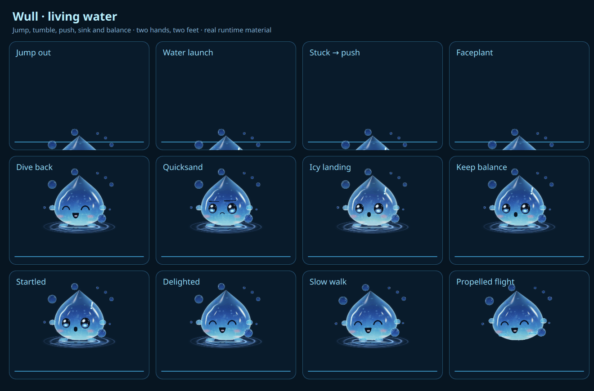
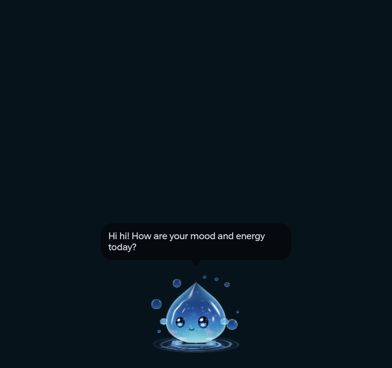

# Wull living water — historical 27-action checkpoint

The latest round three-axis falls and sequential speech controls are in [the 29-action spatial checkpoint](../spatial-20261004/README.md). The captures and behavior below belong to the earlier pinned source.

Checkpoint runtime source: `6bd6cbdcfe79637c87d0e4577753a53566abadaa`, with wider passive nearby awareness and distance-owned popup closure. Earlier source `77dbd3ad0f21cb6177225989d4cd7e3128c32e15` adds the scene-coordinate guard that excludes speech controls from nearby-click reactions. UI captures use `29e88b9b02e2d5a90fd69eb12461bd2c3f93118a`, after simplified UI `1501ebffc`; the guard leaves that presentation unchanged. Initial conversation runtime: `6921fc9943c9412e44936461136753173e1133c5`; mature-popup repair: `d2bc38763`; motion/reactions: `2dfaa00ad`. Test-only repair `968e10961c2d4734721b05dc43529535c5b15230` preserves the initial production bytes. [Design](../../WULL_REFERENCE_DESIGN.md) maps the concept to the implementation.

The saved Blender scene contains **27 actions, two hands, two feet and eight orbiting bubbles**. It authors slower walking, running, flying, jumping, hanging during drag, fall/landing and rich water entrances/exits. Jump, launch, stuck push and faceplant entrances use squash, closed eyes and flailing limbs. Dive, panicked sinking and an icy backside fall/retry animate disappearance. Balance, startle and delight provide interaction reactions. [Reopened-scene readback](blender-readback.json) verifies 1,141 stored keys and 22,119 Blender evaluations, with maximum runtime error `0.000012457859718040254`. Runtime uses the 25,382-byte scalar export, without Blender, meshes, video or sprite decoding.

This board shows twelve rich actions using the actual renderer, with 45 frames at 70 ms capture intervals. All [artifact hashes and sources](artifacts.json) are recorded. It is a preview, not runtime artwork or a frame-pacing benchmark.

Wull stands at the correct normal on top/bottom/left/right water rims and stable registered Abyss bodies. Walking is 16 px/s; running is the former walking speed, 32 px/s; flight remains 105 px/s. The face and gaze rotate with the body. Growing popups carry the actor without replaying appearance; a meaningful shared-water crest can provoke balance and an occasional safe fall. Peek may retract without emerging. Repeated nearby clicks or drag reversals can cause anger and a temporary break.

Curiosity borrows the existing module's mature `StyledPopup`, including its content and slot. Real hover revokes Wull's lease; departure cannot close a human-owned popup. Owned-window tests verify stable content/slot, one popup and no native duplicate. Autonomous visits are limited to Modules, Sidebars, Quicknotes and Notifications. Settings, Dashboard and Dock are excluded from autonomous opening; user-opened Dock/Settings remain habitats. The product default is occasional exploration, enabled. The checkpoint live readback has exploration enabled. Both deployments preserve the user's current Companion preferences; the first deployment retained the then-existing off value.

[Hover controls](hover-controls.png), [explicit chat editor](chat-editor.png) and [English AI settings](settings-ai.png) use QML components from this checkpoint. Resting speech has no title/border/description or text action labels. Hover reveals a blank input and two independent rows of selectable buttons, with the exact five Mood and five Energy values from the Obsidian Journal view. Send/cancel and dismiss are icons; the source icon/accessibility label distinguishes built-in text from local inference. Hover takes no focus; explicit input does. Leaving hides the input, releases focus and retains its draft. Wull stops travel during cloud interaction. Reference vault and AI guidance descriptions are removed from Settings. The settings capture uses isolated defaults, not the user's live vault config. The captured speech is deliberately built-in text, not model inference. Initial UI images remain separately named and source-pinned in the manifest.

The local-default adapter supports an installed Ollama model on loopback only, one bounded request at a time, cancellation and stale-result rejection. It rejects remote models before sending user/journal text and has no cloud fallback. Two Obsidian vaults are connected read-only through the existing shared Todo config and an Abyssal reference vault. Mood/energy questions and deduplicated schedule reminders are **occasional while idle**, per the maintainer's answer. Other journal/reflection text is excluded, and no note is written. This receipt does not qualify an actual configured provider/model or inference latency/residency. Current model inventory, runtime decisions and AI status belong only to the [canonical Local AI plan](../../../to-do/cloud-bot/WULL_LOCAL_AI.md). The checkpoint live readback preserves local AI enabled with no model name configured.

[Initial deployment](deployment.json) records 25 precondition-checked runtime files. [UI deployment](ui-deployment.json) records five files updated to `29e88b9b02e2d5a90fd69eb12461bd2c3f93118a`; [final interaction guard deployment](guard-deployment.json) records two files applied to `77dbd3ad0f21cb6177225989d4cd7e3128c32e15`. Neither UI update writes user config. After reload, Wull is visible on `eDP-1`, the field/scene/actor gates are valid and there is one native companion daemon. No Wull startup errors were observed. Raw user config, backups, desktop images and private event titles are not published.

[Initial canonical validation](feature-validation.json) on exactly `6921fc9943c9412e44936461136753173e1133c5` remains **FAIL: 410 passed, three failed, eleven skipped**. Two tests froze the previous upright=0 implementation spelling; actual four-rim orientation/face/gaze tests passed. The mature-hover proof passed separately but failed its fixed-wait assertion in the full run. The test-only repair removes stale spelling constraints and awaits exposed-window/actual-hover conditions. [Pre-UI canonical validation](pre-ui-validation.json) on exactly `968e10961c2d4734721b05dc43529535c5b15230` is **PASS: 413 passed, zero failed, eleven skipped**, including all 86 Wull Python checks, Qt 6.11.2 parser and a clean validator tree. This result does not certify the subsequent UI change. The superseded UI run is [INTERRUPTED / NOT COMPLETE](ui-interrupted-validation.json), after 357 completed checks and zero completed failures; it makes no canonical PASS claim. The [pre-proximity run](pre-proximity-validation.json) on `77dbd3ad0f21cb6177225989d4cd7e3128c32e15` completed **FAIL: 414 passed, one failed, eleven skipped**. The mature-popup fixture retained an arbitrary 150 ms wait after synthetic hover, which does not move the compositor cursor. The new fixture checks lease handoff at the actual owned hover event, refreshes owned input and awaits semantic retract; it also covers the real Utilities visit hold and idle release. The [proximity canonical run](proximity-validation.json) on exactly `6bd6cbdcfe79637c87d0e4577753a53566abadaa` completed **PASS: 415 passed, zero failed, eleven skipped**, including all 86 Wull Python checks. It certifies only that source.

[Checkpoint proximity deployment](proximity-deployment.json) records four checked runtime files applied to `6bd6cbdcfe79637c87d0e4577753a53566abadaa`, with user config preserved. Clicks now reach 460 scaled pixels and idle notice/gaze 420; all four painted water rims can supply samples. A 650–1,149 ms passive approach may trigger Wave/Inspect/Startle, with a 12–25 second cooldown and no annoyance accumulation. Chat/movement/tasks/anger/directed visits gate reactions. Once Wull reaches a feature, a gap beyond 140 scaled pixels closes only its owned popup while the departure continues. Grabbing/clicking Wull or using its speech closes an unclaimed visit; actual feature hover takes over. Sidebars become transient on handoff, and Utilities resumes its existing idle-close timer when the visit hold ends. Owned Qt proofs cover a 350-pixel approach without a click, cooldown/leave/chat gates, distance close/continued travel, one mature slot, Utilities hold/release and real four-rim Region boundaries. This is not global pointer observation across unrelated applications.

Source/owned-window checks cover geometry, motion, four-rim gaze, carry/balance/fall, clicks/shaking, peek-only/icy retry, mature popup ownership, local-only HTTP, read-only vault parsing, English chat, cancellation and offline labeling. Native global pointer observation is limited to Wull and existing Abyss input surfaces; unrelated desktop windows are not intercepted. Native physical input, multi-output/hotplug/suspend/fractional scaling and whole-session CPU/GPU/PSS remain separate acceptance. Optical budgets remain unchanged. The original concept was compared visually: lighting, internal liquid detail and contact reflection still differ, so no 100% likeness, full-image lossless parity or measured resource savings are claimed.
