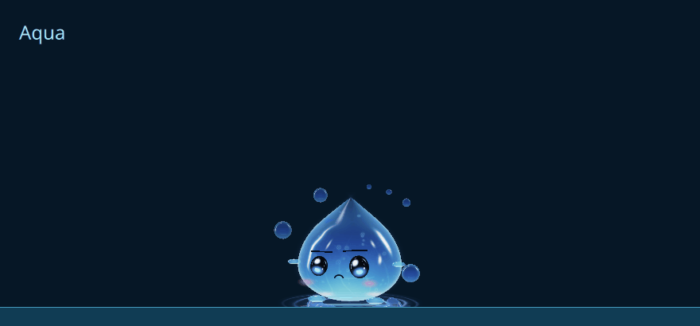
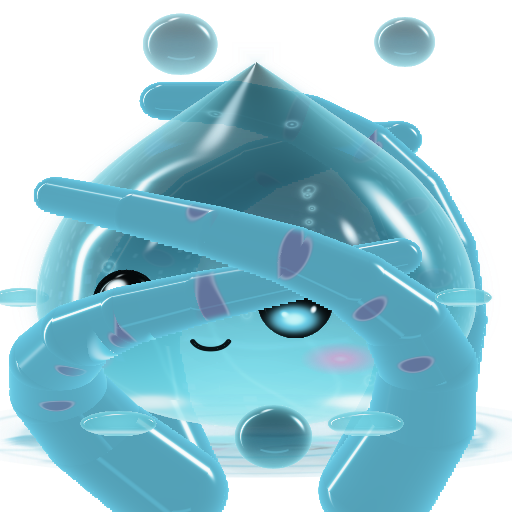

# Aqua and Octo: one body, opaque tentacles and water takeovers

Runtime/Blender/GPU source: `f0e70dd98ae8d6bcf0a6cc49b41b2aa003578c24`.

Octo has four short, plump tentacles, 16 cups and a larger round head. Tentacle interiors have alpha 1; only antialiased edges fade. Front arms hide rear arms. The head retains slight translucency, procedural environment reflection/refraction, glossy eyes and live Abyss theme colors. Aqua retains its centered tip, two hands and two feet.

Both editable Blender rigs have **30 actions**. Aqua does not have quicksand. When they take turns, Octo sinks and Aqua is pulled into the water over **5,600 ms**. Only one Companion body exists in the output's cast. During Aqua's exit, four tentacles rise, embrace from behind and coil across the front; no Octo head/body appears. The successor emerges at exactly the outgoing placement after its presentation reaches zero. Every new visit receives the existing eight-second minimum. Crowded rims no longer need space for a second character. Chat/task, drag, policy, support and reduced-motion cancellation remain authoritative.

Select **Settings → Abyss → Companion → Companion**, then optionally enable **Take turns on the desktop**. Existing settings were preserved; fresh-install default-off and the compatibility `wull` namespace remain. AI planning/status stays in the [canonical plan](../../../to-do/cloud-bot/WULL_LOCAL_AI.md).





The GIF contains **101 owned GPU frames** from the actual cast/presence/body components. Its water strip is a preview backdrop. It is not a desktop capture, native field proof, resource benchmark or FPS measurement. The comparison and volume captures use a private exact-source archive, OpenGL RHI and private fixture configuration. The settings image is retained from `04d40521412561718dbbffc9fcfeeec0eedabcc1`; the controls are unchanged. [Artifact hashes](artifacts.json), [Blender reopen receipt](blender-receipt.json) and [native readback](native-readback.json) retain separate source identities. No preview image/GIF/Blender process is loaded by the runtime.

The reopened Blender files verify **13,005 Aqua and 18,258 Octo curve samples**, with maximum error `2.02e-5`; round fall matrices retain unit volume. Octo's saved mesh has real GripBase/GripRise/GripWrap keys and moving cups; the front coil tip crosses to `(28, -22, 0)` in Blender coordinates. Runtime reads exact scalar curves and traces live 3D volumes.

Actual Qt tests pass on all four rims in both directions: one body, fully hidden before switch, same opening, shared grip clock, 5.6-second exit, minimum visit, held/policy/motion cancellation and crowded support. GPU tests verify round falls, four opaque tentacles, front/back grip layers, central painted coils, reflection, both current quality tiers and live theme retint. Production, render-cost and hidden-clock contracts pass. Latest integration recheck on exactly `1afd09f2ca0944da8bbc26da471898e446883da0` also passes the cast and GPU tests; [focused receipt](focused-integration.json) is separate from the earlier canonical and installed-source identities.

The installed Companion update applies **11 precondition-checked files** over the earlier 54-file Aqua/Octo installation. Native IPC observes both sequential directions, Octo presentation and field frame submission; one companion daemon remains. Prior preference values and the user's cast selection were restored, with no Companion warning/error observed. These checks do not certify physical input/hotkeys, every native feature, multi-output/hotplug/suspend/scaling, full-image parity, reference resemblance percentage or whole-session CPU/GPU/RAM use.

Canonical validation on exactly `f0e70dd98ae8d6bcf0a6cc49b41b2aa003578c24` is **FAIL: 367 PASS / 16 FAIL / 2 SKIP**, with Qt 6.11.2 parser PASS and a clean validator tree. All 16 failed identities overlap the preceding `0c804b5ac511733958ad9ac1fd1073b215264f75` run (364 PASS / 17 FAIL / 2 SKIP); identity overlap is not causal attribution. This remains a repository-wide FAIL. [Exact receipt](validation.json) retains failed identities and private-log digests without publishing private logs. Later `dev` commits and this evidence publication are not certified by that canonical run.

Reproduce focused checks with `python3 scripts/test-companion-cast.py` and `python3 scripts/test-companion-volume.py`. Author/reopen the editable scenes with:

```sh
uv run --python 3.11 --with bpy==4.3.0 --with 'numpy<2' python scripts/companion-author-models.py
uv run --python 3.11 --with bpy==4.3.0 --with 'numpy<2' python scripts/companion-verify-blender.py --output /tmp/companion-blender-reopen
```

The rigs are [AquaMotion.blend](../../../assets/aqua/AquaMotion.blend) and [OctoMotion.blend](../../../assets/octo/OctoMotion.blend). `scripts/wull-fixtures/companions/CompanionTurnPreview.qml` exports owned frames through `COMPANION_TURN_PREVIEW`; `CompanionVolumeProof.qml` exports optical controls through `COMPANION_VOLUME_OUTPUT`. Use the existing private staging/environment helpers from `scripts/wull-manual-visual-matrix.py` to avoid loading personal settings.
