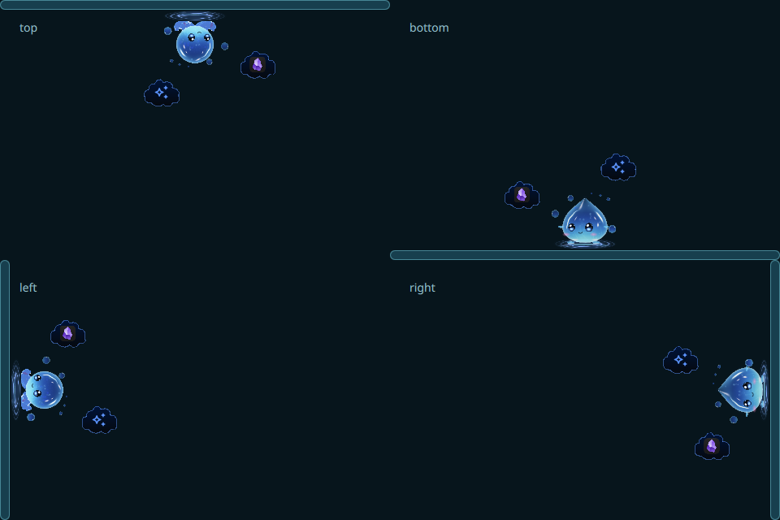
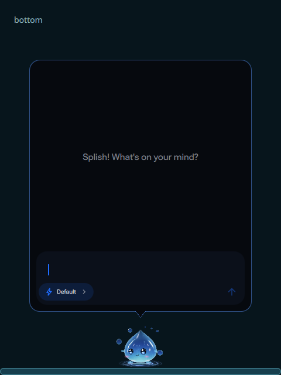

# Bordered Companion clouds on an inward orbit

UI and owned-capture source: `2f3637148a4f5d005413c8d86a086fd4aaf1971a`.

The chatbox now has a thin Abyss accent border and a curved outlined tail. Obsidian/context and AI/chat actions use smaller cloud contours with fully curved bottoms, gradient fill and an accent border. Icons stay upright while the orbit turns inward for Top/Bottom/Left/Right Screen Edges. Scaled body alignment and corner clearance are included; a crowded viewport hides an impossible orbit instead of stacking its actions.

These are owned GPU fixture items with private default configuration, not desktop screenshots. The montage joins four separate views; it does not depict multiple Companions on one desktop. Each cloud has its own native input footprint, leaving the space between the clouds available. The existing finite hover deadline is retained; no orbit clock, new liquid shader or full-screen hit target is introduced. Passive Mood/Energy questions retain separate choice rows and no prompt input, while explicit chat retains focus, draft/history and model/effort controls.

Focused checks pass 300 geometry cases across four edges, corners and scale factors. Actual owned Qt checks verify node hover, empty-space pass-through, finite hide and both context/chat clicks at every edge, plus explicit chat and fixed-size GPU frame exports. The controlled local speech/helper fixture, host policy, shared input and production contracts also pass. One parallel draft speech probe observed a transient journal-context reset; the isolated recheck passed. That observation has no established product cause and is separate from final exact-source validation.

The installed four UI files match the UI source. Three were already current; the final cloud hover update was applied atomically with a private backup and followed by a shell restart. Native backend/field/frame readback is ready and one Companion daemon remains; existing preference values are preserved. Configuration bytes differ; the receipt records preservation of existing preference values, and byte identity is not claimed. [Native receipt](native-readback.json) distinguishes installed-file checks from physical input, multi-output/lifecycle and whole-session resource acceptance.

Canonical validation is **PASS: 389 PASS / 0 FAIL / 2 SKIP** on exact source `57c5fca52beca4f24d0c86f596c34c8fcd1cd87d`. The four production UI files are byte-identical to the capture source above. Qt 6.11.2 parsing and the clean validation tree pass; the two skips are manual perimeter acceptance and deferred Nix validation. [Exact validation](validation.json) records the private-log digest and remaining native/package/resource boundaries. [Artifact manifest](artifacts.json) pins these owned captures and receipts. Later dev or documentation commits do not inherit this exact-SHA certification.

Reproduce the bounded owned proof with `python3 scripts/test-wull-cloud-orbit.py`; add `--capture-dir` with a new directory to retain its five frames. Existing speech/helper coverage is `python3 scripts/test-wull-mind-ui.py`. Runtime never loads these PNGs or the montage.
