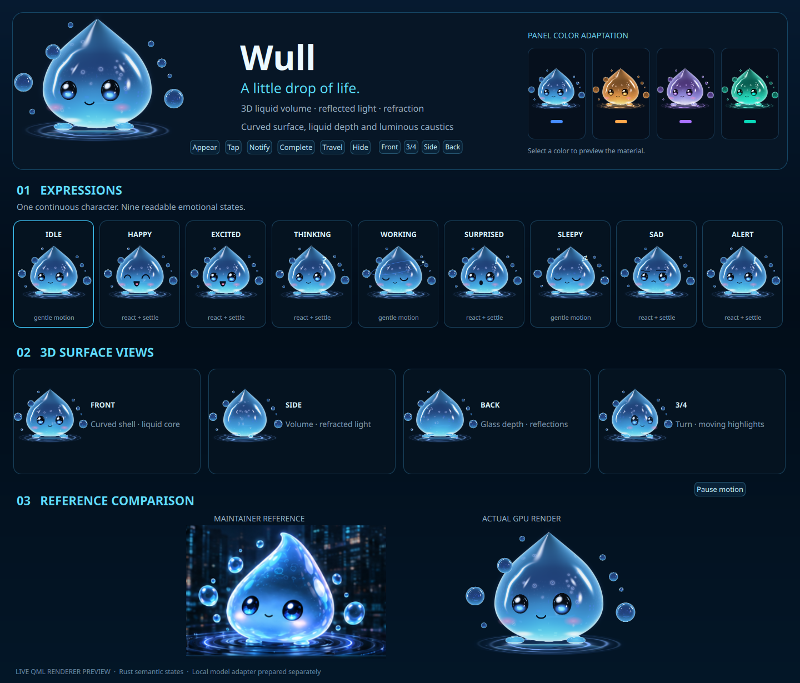

# Wull 3D liquid design and reference comparison

Source: `a1156722159c7840eda93ad37ad5e9dfb1e229b8`, branch `dev`.

[Motion demonstration](motion.mp4): 180 distinct real QML captures encoded as a 9-second, 20 fps video at 1440×1230. Encoding cadence is a presentation choice, not measured runtime frame pacing. The sequence shows all nine expressions, local motion, shine/ripple reactions, position interpolation, actual 3D camera rotation, palette transitions and fade-out. The tip is centered and evenly pointed. Two pairs of small 3D water feet rotate with the body; the rear pair is recessed so the front view keeps the reference's two visible base pods. The floor mirrors the body, feet and face with perspective compression, localized contact light and distance fade.

[Software fallback](software-fallback.png) is a separate Qt software capture with the same centered contour, four water feet and face vocabulary with simpler material. The GPU renderer uses a 3D implicit volume, curved reflections, bounded refraction, glossy corneas and its own small floor-reflection texture. Neither renderer uses raster character art.

The bottom row places the [unmodified supplied close-up](reference-closeup.png) beside the actual runtime renderer at a comparable body size. This is a direct visual comparison, not a numerical resemblance score. Lighting, internal light pattern and contact-caustic detail still differ from the reference; **100% resemblance is not approved**.

Live Abyss palette binding was also exercised in one isolated QML process. Wull's `accentColor` was left at its default binding while process-local `Appearance.colors.colPrimary` changed. After the color transition, the actual body accent equaled both `AbyssStyle.accent` and the panel's lightness role in all four cases: [blue](live-panel-blue.png), [amber](live-panel-amber.png), [purple](live-panel-purple.png), [green](live-panel-green.png). The four captures each contain only a fixed 160×160 component board; [binding readback](live-panel-binding.txt) records the actual color values. No user shell settings were persisted. These are component binding checks, separate from upstream desktop theme UI acceptance.

[Provenance](provenance.json) records artifact digests, unchanged original references, live palette observations and immutable renderer/native source blobs. These captures are development evidence and are never loaded as runtime character art. Only each preview's own QML item was captured, with isolated config/data/cache. The core daemon was not launched by the gallery; a separate real stdio process test exercised nine intents, TTL restoration of a waiting task and quiet hide. The verified Rust/protocol source is byte-identical to this renderer revision.

Status: **MANUAL VALIDATED / source renderer preview**. Maintainer resemblance approval, native production panel/popup/input acceptance and resource qualification are pending. Production Wull remains default-off. See [design and remaining acceptance](../../WULL_REFERENCE_DESIGN.md).

Canonical Qt 6 validation of the exact source revision above finished with **369 PASS / 39 FAIL / 2 SKIP**, including all 75 Wull Python regressions and the Qt 6.11.2 parser. [Exact summary](canonical-qt6-summary.txt) and [validation history](validation.json) retain tested revisions and failure attribution. The 38 failed-check identities from the first recorded run remain; 24 static baseline failures were already reproduced offline. This run also failed the anti-flashbang brightness fixture at its first dimming check. Its fixture and brightness sources are unchanged from the preceding revision. A check before the animated brightness settles is a possible timing explanation, not a verified cause; this additional failure remains unresolved and was not rerun or reclassified as a baseline failure. This remains a repo-wide **FAIL**, separate from the passing Wull source/renderer checks. This capture/documentation update does not extend that exact-source verdict to native desktop behavior or hosted CI.
