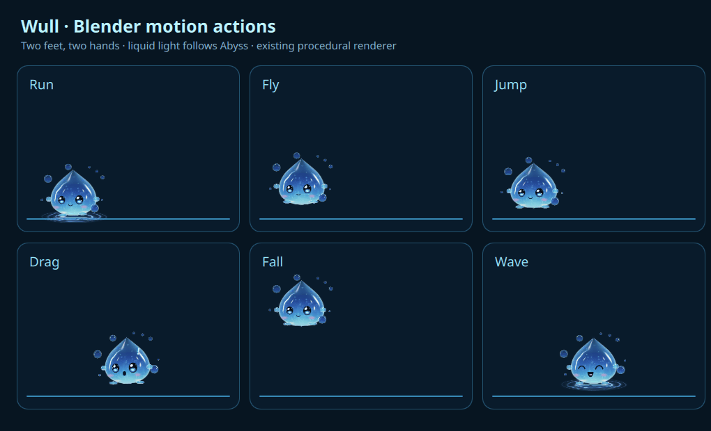

# Wull lively motion — historical sixteen-action checkpoint

Runtime feature: `3ce40c2380b2bc7e8fc1917a151ca07ab9f226cb`; keyboard-focus repair: `d57e59f1a8bb0f0e4a37d05db381665ba700157e`. This checkpoint precedes the [following 27-action checkpoint](../alive-20261004/README.md) and [current spatial-motion checkpoint](../spatial-20261004/README.md).

The editable Blender scene has sixteen actions, exactly two hands and two feet, 485 exported keys and 9,999 evaluated samples. [Saved-scene readback](blender-readback.json) retains the actual blend/curve digests. Walking, running, jumping, flight, accelerated drop, re-grab, release takeoff and feature gestures use exact scalar tracks in the runtime renderer. Blender and these preview frames are not runtime dependencies.

The board contains 26 owned GPU frames at 70 ms capture intervals. [English behavior settings](settings-behavior.png) shows the exploration switch. [Artifact identities](artifacts.json) retain the capture source and hashes; capture/encoding timing is not desktop frame pacing.

[Feature validation](feature-validation.json) is PASS on exactly `3ce40c2380b2bc7e8fc1917a151ca07ab9f226cb`: 409 passed, zero failed, eleven skipped. [Final checkpoint validation](final-validation.json) separately records PASS on exactly `8c0cbb2525e7a341bba56854145200adbbabb751`, after the focus fix and duplicate English-key repair: 409 passed, zero failed, eleven skipped; all 82 Wull Python checks passed, with Qt 6.11.2 parser and clean validator tree. Neither result certifies a later revision.

These tests use owned QML windows and controlled geometry. Native physical input on every feature, multi-output/lifecycle behavior, concept approval, full-character pixel parity and whole-session resources remain unqualified. AI was deferred at this historical checkpoint; its development resumed in the current work.
