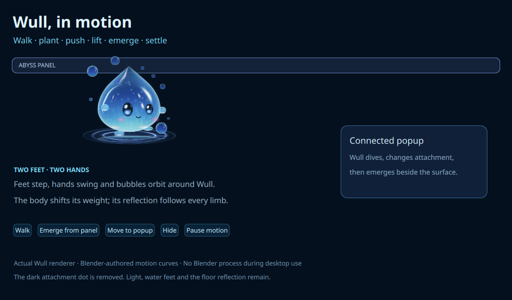
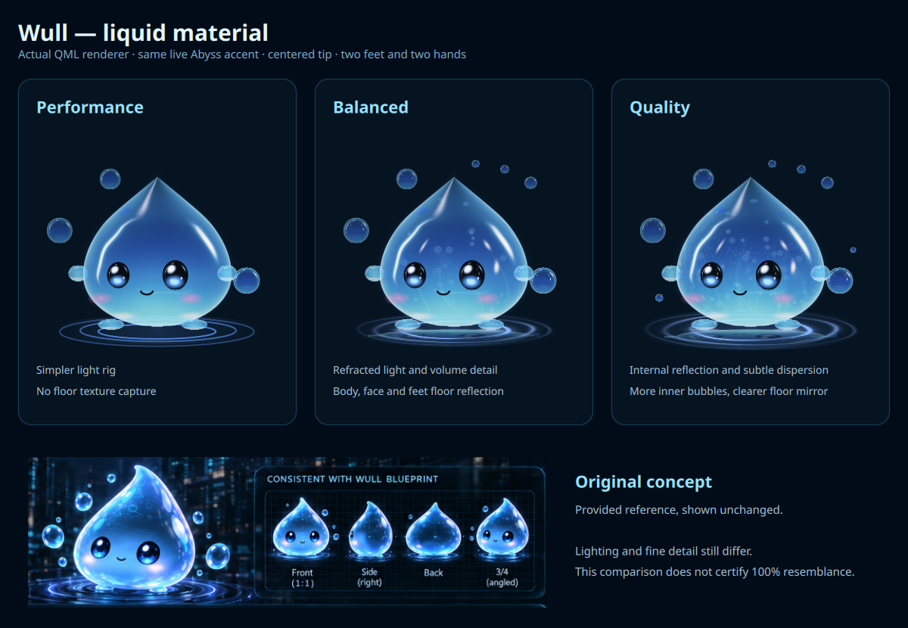

# Wull: two feet, two hands and living motion

Runtime source: `99cd39d2cfad20fab3ce9abc0a7dcac9ab44a459`, branch `dev`. Test repair `bea5a3b3880e03b5d081fca3a4df5630bb11aa71` changes no runtime bytes. AI implementation remains deferred.

Exactly two flattened ground feet step alternately; two higher side hands swing independently. All four limbs share the liquid material. The body shifts its weight, compresses and stretches during the gait. The floor mirror includes the body, limbs, face and bubbles, while each foot's contact light fades as it lifts. The detached dark attachment oval is removed. Nine expressions, slight translucency and live Abyss Panel color adaptation remain.

The editable [Blender scene](../../../assets/wull/WullMotion.blend) contains the actual mesh, two arms, two feet, eight orbital bubbles and five actions: Walk, Emerge, Dive, Hop and Orbit. The [saved-scene readback](blender-readback.json) checks anatomy and every exported key against the saved `.blend`. [Blender evaluations](blender-evaluations.json) and [parity result](blender-parity.json) compare 1,818 runtime samples against Blender 4.3.0 F-curve evaluation; the maximum error is approximately 0.00000153, within float32 evaluation roundoff. Every authored LINEAR key retains Blender's stored precision; only unused zero/one constant defaults are implicit. There is no frame resampling, sprite sheet or rendered animation loaded by production Wull.

[The nine-second video](motion.mp4) contains 180 actual QML own-item captures presented at 20 fps. Its 157 distinct images include the intentionally identical hidden tail; 20 fps is the encoding rate, not measured desktop frame pacing. [Motion readback](motion-behavior.json) records actual walking, emergence, moving bubbles both in front of and behind the body, and frozen hidden clocks. [Emerging from the panel](emerging.png) and [settling beside a popup](beside-popup.png) show the actual `AbyssCompanion` host in an isolated development scene. The depicted panel/popup are fixture geometry; this is not live native popup or pointer acceptance.

Production integration maps sparse Rust destinations into one verified free Bar interval. The complete walking path avoids Bar modules; stable existing Panel/Popup content bounds offer a separate full-host rectangle beside the surface. Wull dives, changes attachment while hidden, then emerges. Unsafe placements hide it. The existing perimeter window and single input Region remain; input readiness releases capture during emergence and relocation. Hover and active tasks stop walking. Unrestricted desktop exploration, drag placement and full native interaction remain acceptance work.

The actual three-tier check verifies two hands at body height and two feet at ground height in every preset, 3/6/8 external bubble budgets, the Performance ceiling and the existing own-floor texture policy. Balanced and Quality keep reflection sizes of 76×82 and 152×164. [The gallery](gallery.png) compares the current GPU renderer against the unchanged concept, including nine expressions and four 3D views. [Software fallback](software-fallback.png) retains the same anatomy with simpler vector optics. Lighting, interior patterns and fine reflection detail still differ from the concept; no measured resemblance percentage is claimed. English Companion settings and their earlier control proof remain [available](../settings-20261003/README.md); those historical images retain the old four-foot anatomy.

Runtime loads the shared scalar curves (about 3 KB), the existing shader material and local animation clocks. It does not load the 1.1 MB authoring scene, run Blender, decode video or stream animation frames over IPC. Shared layouts and cached yaw/orbit calculations avoid repeated work without lowering optical budgets. Actual hidden gait, orbit, shimmer, bob and sway clocks stop. The [owned release-daemon check](native-wander-quiet.json) observes a real bounded walking suggestion after about 11.65 seconds, then a quiet hide: no extra state and zero CPU-tick increase over two seconds, at 100 ticks/second resolution. Sampled daemon PSS is 667 KiB. Its [fixture](native-resource-fixture.py.txt) opens one owned stdio process and closes it; these are short daemon observations, not QML/GPU, whole-session resource improvements or runtime FPS measurements.

Strict full-image GPU **lossless parity is INCONCLUSIVE**. The [identical-source control](gpu-identical-source-control.json) uses byte-identical bodies and equal coordinates, yet Balanced/Quality captures still differ. An independent [one-renderer-per-process control](gpu-single-renderer-control.json), with [pointer handlers disabled and equal frozen inputs](gpu-single-renderer-fixture.py.txt), also differs at those tiers. The [optimization diagnostic](gpu-optimization-diagnostic.json) therefore cannot attribute differences to layout/math reuse. [The status record](lossless-status.json) keeps the zero-difference threshold and separates exact curve export from unverified GPU pixel parity. No tolerance was introduced to manufacture a PASS. The current [comparison tool](../../../scripts/wull-verify-lossless-render.py) requires a qualified identical-source control before attribution.

[Focused proof](focused-proof.txt), [frame digests](motion-frame-hashes.json) and [provenance](provenance.json) retain scope and source identity. Production remains default-off. Physical pointer pass-through, live panel/popup paint, multi-output/fractional-scale/hotplug/suspend behavior, long-session CPU/GPU/PSS and maintainer visual acceptance remain open. Historical runs and original reference assets are preserved.

Open `qs -p wullMotion.qml` for the interactive motion study or `qs -p wullDesign.qml` for expressions, themes and reference comparison. Both reuse the production renderer; they do not start a companion daemon or save user settings.

The canonical local validator on exact source `bea5a3b3880e03b5d081fca3a4df5630bb11aa71` finishes **370 PASS / 39 FAIL / 2 SKIP**, including **all 76 Wull Python regressions PASS** and the Qt 6.11.2 parser. [Validation record](validation.json) and [summary](canonical-summary.txt) retain the exact SHA and private-log digest. Thirty-eight remaining failed-check identities match the earlier source's report. The additional desktop-repair failure is the `--current-repo` validator's detached SHA conflicting with that diagnostic's required `dev` branch; it exits before changing anything. Repo-wide status remains **FAIL**; identity overlap alone does not causally classify every failure.

The [initial canonical run](canonical-initial.json) on `99cd39d2c` found four stale Wull input-mask/orientation assertions. The focused test repair retains exact historical pre-locomotion source blobs, confirms the old private BBOX helper rejects unqualified moving production, and evaluates the actual current input Region expression across readiness states. Runtime behavior was preserved. [Initial summary](canonical-initial-summary.txt) remains unchanged; no historical live pointer job was replayed.
