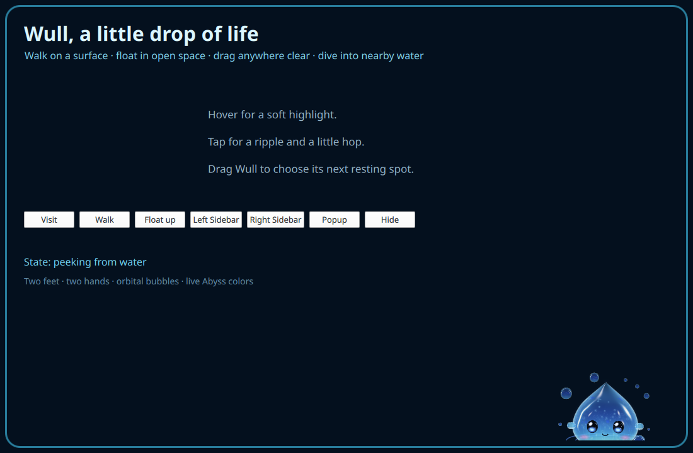
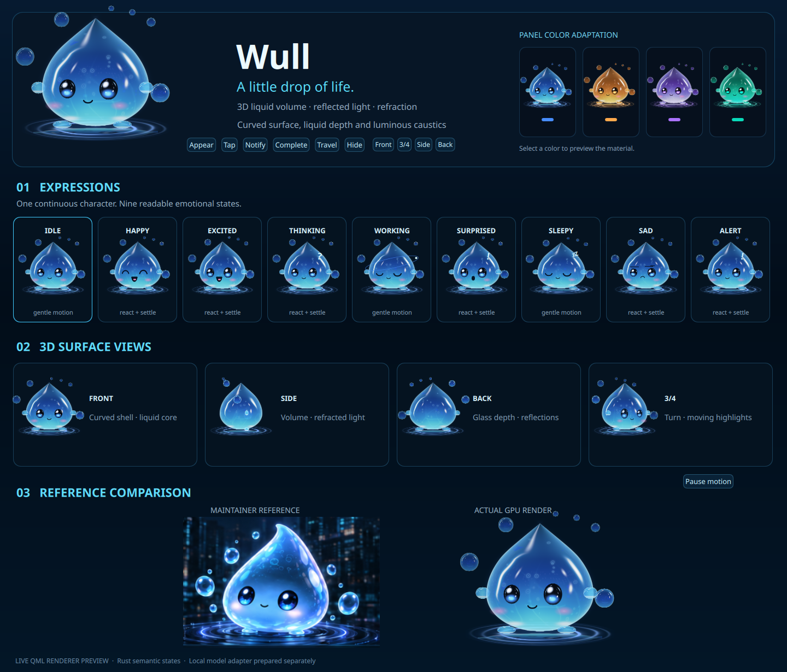
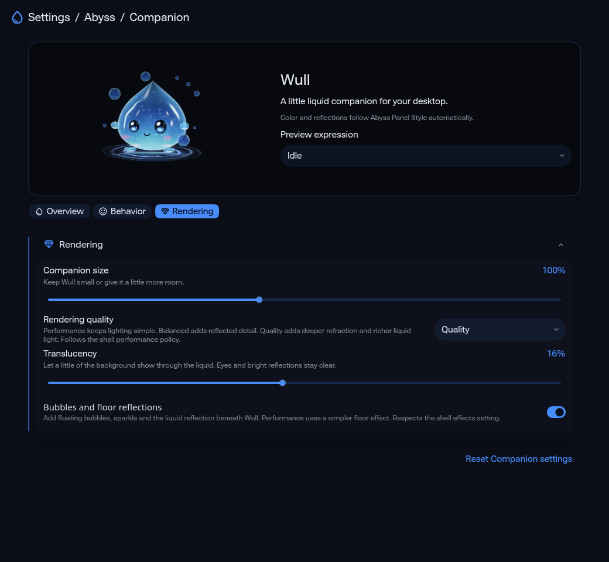

# Wull: peek, free visits and direct interaction

Feature source: `79490997ee146a6ef2428ce1abe45e53683ec071`. Reached-water dive fix: `5def317ddc6f934c9cb0730085030fa6e02d73e3`. Preview tooling and canonical tested source: `e9c032bdde3fe7e9952cb3964d732b1fa73d862d`, branch `dev`. The tooling commit changes no production bytes. AI implementation remains deferred.

Wull first peeks above the water opening, pauses to look into the screen, then rises. Hide during peek retracts through the same opening. Partial presentation captures no input. Visits choose among all four screen water rims and stable existing Left/Right Sidebar or Popup bounds. Available surfaces have a 35% initial visit chance; a still-open surface gets one movement offer after twelve seconds, with a 62% offer chance. Hover and active tasks defer that offer. These percentages describe bounded controller choices, not measured user-session frequencies.

Walk requires continuous horizontal support beneath the complete scaled host and along the entire path. Elsewhere Wull uses the Blender Float action, with relaxed feet and a different arm/body pose. Routes avoid occupied surfaces; unavailable paths fail closed. Hover softly brightens the material and stops travel at its current position. Tap adds rings and a hop. Eyes prioritize travel and activity, then smoothly follow a fresh nearby pointer sample with subtle local eye movement. Passive samples come from existing shell input surfaces; the compositor mask does not expand across unrelated windows.

Drag/drop moves Wull to a clear output-local position and can land on a nearby surface. Release does not generate an extra tap. On normal hide, Wull flies to the nearest reachable water rim and dives through the newly reached edge. Backend or policy loss instead removes input and presentation immediately. The one existing perimeter window, bridge and complete-host input Region remain. No production frame polling or high-rate IPC was added.

The actual implicit liquid renderer retains two feet, two hands, orbital bubbles, nine expressions, theme-adaptive reflection, refraction and slight translucency. The original close-up remains unchanged beside it. Lighting, internal patterns and contact detail still differ; there is no measured resemblance percentage or 100% visual approval. The gallery was captured on `e9c032bdd`. The peek image was captured on `79490997e`; the later host change affects retreat edge selection, not the captured peek branch. Exact source blobs and artifact hashes are in [provenance](provenance.json).

Overview, Behavior and Rendering remain English. Size is in Rendering. Fixed display, edge and along-edge controls are removed; legacy saved keys remain schema-compatible and are ignored by normalized placement. Calm/Balanced/Energetic, appearance frequency, motion/effects, translucency and Performance/Balanced/Quality remain. The isolated real-control check saves, reopens and resets Companion settings, including legacy config migration, without changing the user's settings.

The editable [Blender scene](../../../assets/wull/WullMotion.blend) now has Walk, Float, Emerge, Dive, Hop and Orbit. [Saved-scene readback](blender-readback.json) verifies two feet, two hands, eight bubbles and all 174 exported keys. [3,030 actual Blender evaluations](blender-evaluations.json) agree with runtime interpolation within float32 rounding: maximum absolute error `0.0000015211`, threshold `0.00002`. [Parity](blender-parity.json) certifies scalar curves only. Production never loads the authoring mesh, runs Blender or decodes animation video. Hidden/motion-disabled gait, orbit, bob, sway, shimmer and reaction clocks stop; airborne Wull removes its floor capture. Optical and texture budgets are unchanged.

[Software motion study](software-motion.mp4) uses 180 own-item captures encoded as nine seconds at 20 fps. It demonstrates walking, float-up, tap, drag and water retreat, with [behavior readback](software-motion-behavior.json) and [frame hashes](software-frame-hashes.json). It uses the simpler vector fallback, so it is behavior evidence, not 3D optical evidence. Encoding rate is not measured desktop frame pacing. [Walking](software-walking.png), [floating](software-floating.png) and [water dive](software-water-dive.png) are selected software frames.

The current **GPU multi-frame export is INCOMPLETE**: owned default captures timed out after forty seconds; private offscreen/basic-loop probes did not qualify that path. Single 3D gallery and peek captures passed. No production rendering flags were changed. The [capture status](capture-status.json) keeps this separate from the successful software export. Earlier identical-source controls leave strict full-image GPU lossless parity inconclusive; they are not reused as acceptance of this change. No whole-session CPU/GPU/RAM or FPS improvement is claimed.

Focused scene/attention checks cover 3,345 cases and fourteen complete paths. The actual Qt owned-window test exercises peek/retraction, hover interruption, tap, gaze priority, supported walk, float-up, drag, the reached dive edge, policy hide, hidden clocks and a sustained-popup visit. It injects events only into its own offscreen test window, with isolated storage; it does not provide native compositor input acceptance. [Focused record](focused-proof.txt) retains that boundary.

Canonical validation on exact `e9c032bdde3fe7e9952cb3964d732b1fa73d862d`: **370 PASS / 40 FAIL / 2 SKIP**, all **77 Wull Python regressions PASS**, Qt 6.11.2 parser PASS. [Validation](validation.json) and [summary](canonical-summary.txt) retain exact identity and private-log digest. All thirty-nine failed-check identities in the previous report overlap; anti-flashbang content sampling is the additional failure. Overlap alone is not causal attribution. The [initial run](canonical-initial.json) on `79490997e` had the same counts and failed identities. No unrelated failure assertion or automation history guard was weakened. The overall repo status remains **FAIL**.

Production remains default-off. Fresh native four-edge/Sidebar/Popup paint, physical pointer pass-through/drag/context menu, multi-output/fractional-scale/hotplug/suspend and long-session resource acceptance remain open. Historical artifacts and original reference assets are preserved.

Open `qs -p wullPresence.qml` for interaction, or `qs -p wullDesign.qml` for expressions, panel colors and comparison. Both reuse production components with isolated development geometry, without starting a second companion daemon. Reproduce focused input checks with `python3 scripts/test-wull-presence-interaction.py`. Capture a 3D peek with `python3 scripts/wull-render-design.py --presence --peek --output /absolute/new.png`; export fallback motion with `--software --presence --frames /absolute/empty-directory`.
