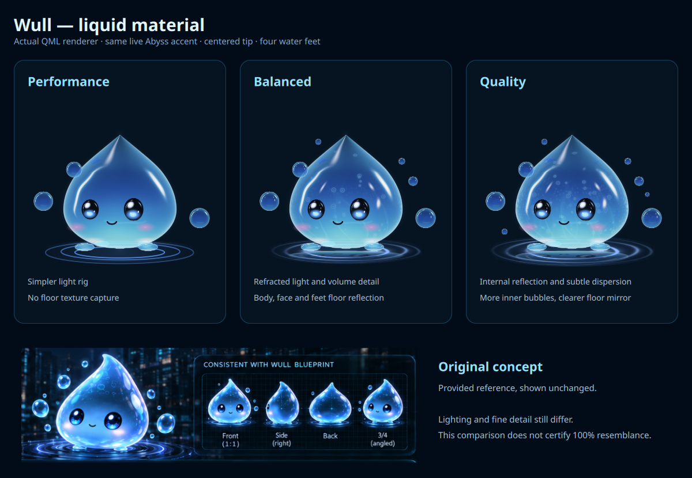
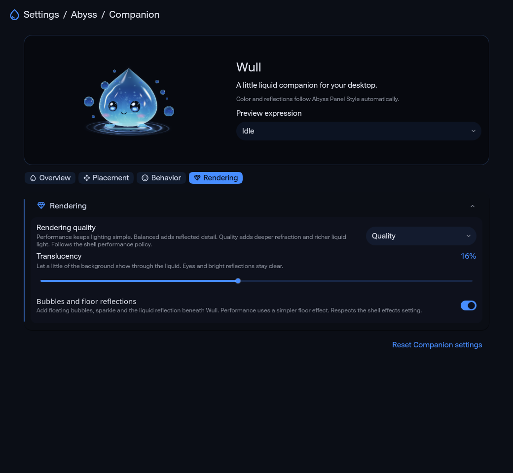

# Wull liquid material and Companion settings

Runtime source: `2af514d9415dda3a73914ccff8195cf73f2da60f`, branch `dev`. The native behavior change is `037d096ea2e604f601c2cda417bdd1adc2499f93`; its Rust source is byte-identical at this renderer revision.

Canonical validation ran on `bf7da25c17cb0d20d4a545888394200999c0ade7`, whose renderer/settings/native inputs are byte-identical to the capture revision. The only intervening source change preserves the exact old default-config blob for an inert historical visual test.

Performance uses a simpler light environment and no floor texture. Balanced adds refracted light, volume detail and Wull's own floor mirror. Quality adds a bounded internal reflection, subtle color dispersion, more internal bubbles and a sharper mirror. All keep the centered pointed contour and four small water feet. The rear pair remains recessed, leaving the reference's two visible base pods. The shell Performance and effects policies remain authoritative.

Open **Settings > Abyss > Companion**, or right-click an interactive Wull. The English page has Overview, Placement, Behavior and Rendering sections. It offers Calm / Balanced / Energetic, Always visible / Every minute / Every 3 minutes / Every 10 minutes, placement and size, motion/effects controls, and Performance / Balanced / Quality. The live preview shares the production renderer and starts no second daemon.

[Behavior controls](settings-behavior.png) and the [narrow page](settings-narrow.png) were rendered separately. Actual controls were exercised with an old configuration missing the new fields; saved preferences were read after reopening, followed by Companion-only reset. The preview followed personality, effects, quality, size and translucency bindings. Storage and D-Bus were isolated; no user settings were persisted.

Translucency defaults to 16%, adjustable from 0 to 35%. The control slightly lowers the liquid's opacity while keeping glossy eyes and bright reflection catches dense. It blends background through the body; it does not capture or distort desktop pixels. Three actual RGBA captures at [0%](translucency-0.png), [16%](translucency-1.png) and [35%](translucency-2.png) have sampled upper-core alpha of approximately 0.952, 0.870 and 0.772, while both eye samples stay above 0.99. [Readback](alpha-samples.json) records these local samples, not a whole-character opacity percentage.

[The gallery](gallery.png) shows all nine expressions, real 3D camera views and the original reference comparison. [Motion](motion.mp4) contains 180 distinct real QML captures presented at 20 fps for nine seconds. This demonstrates movement, reactions, yaw, color transitions and disappearance; the encoding rate is not a measured runtime FPS result. [Software fallback](software-fallback.png) retains anatomy and expressions with simpler vector material.

Live panel-role binding was exercised in one isolated QML process without overriding the body's accent: [blue](live-panel-blue.png), [amber](live-panel-amber.png), [purple](live-panel-purple.png) and [green](live-panel-green.png). The actual accent and reflection colors matched `AbyssStyle.accent` and `AbyssStyle.specular` after each process-local primary-color change. [Readback](live-panel-binding.json) and the [fixture](palette-fixture.qml.txt) retain this component proof, separate from live desktop theme acceptance.

The [real stdio receipt](native-presence.json) records a 20.0008-second visit and 60.0009-second period, with a quiet hidden gap. Preferences preserved an ongoing task, a temporary expression restored its exact working baseline, and Always did not revive Wull after a policy hide. Seventeen Rust state-machine tests and all-target clippy with warnings denied passed for the native revision above. A separate real QML/native bridge check verified initial preference-before-show ordering, live profile changes and quiet hide. No model is installed; local-model integration uses the existing bounded, expiring expression intent contract.

[Provenance](provenance.json) pins source blobs, artifact digests, reference identity and verification limits. [Focused proof](focused-proof.txt) records the renderer/settings capture results; [frame digests](motion-frame-hashes.json) retain the 180 unique captures. The four original boards still match the maintainer's Downloads byte-for-byte. The retained close-up is unchanged from its previous verified revision; its temporary clipboard original is no longer present.

Status: **MANUAL VALIDATED / source renderer and settings only**. Lighting, interior pattern and contact detail still differ from the concept. No 100% resemblance approval, fresh native panel/popup/input acceptance or CPU/PSS/FPS qualification is claimed. Production remains default-off; automatic desktop travel, drag placement and context-menu actions remain integration gates. See [design and acceptance limits](../../WULL_REFERENCE_DESIGN.md).

Canonical Qt 6 validation finished with **371 PASS / 38 FAIL / 2 SKIP**, including **all 76 Wull Python regressions**, the Qt 6.11.2 parser, and prefix/packaging lifecycle checks. The [exact summary](canonical-qt6-summary.txt) and [validation record](validation.json) retain the SHA, private-log digest and failed checks. The 38 remaining failed-check identities were already present in the [earlier report](../design-20261003/validation.json); identity overlap is not a fresh causal reproduction of every failure. Repo-wide status remains **FAIL**. The anti-flashbang fixture that failed in that earlier report passes in this run; its previous failure's cause was not resolved by this work.

The [initial source run](canonical-initial-summary.txt) had 370 PASS / 39 FAIL / 2 SKIP, including one Wull historical-defaults check. It incorrectly pinned the evolving live `defaults/config.json` instead of the old trial's immutable config. The test repair retains blob `e10d98c0f26d3e47c51cb8452bcd0d2cea735501`, exercises the historical config and keeps the reviewed runner/digests and isolation assertions unchanged. No historical live trial was replayed and no runtime behavior was reverted. The second canonical run above verifies the repair.
