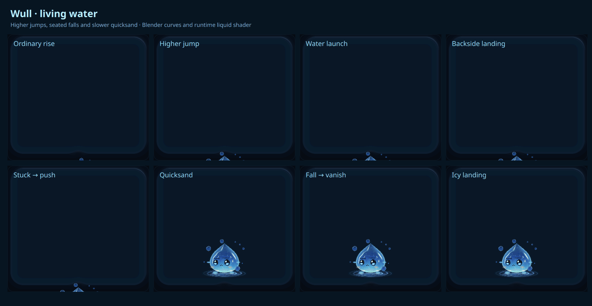
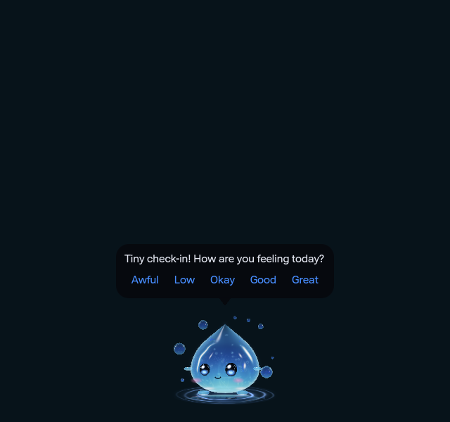
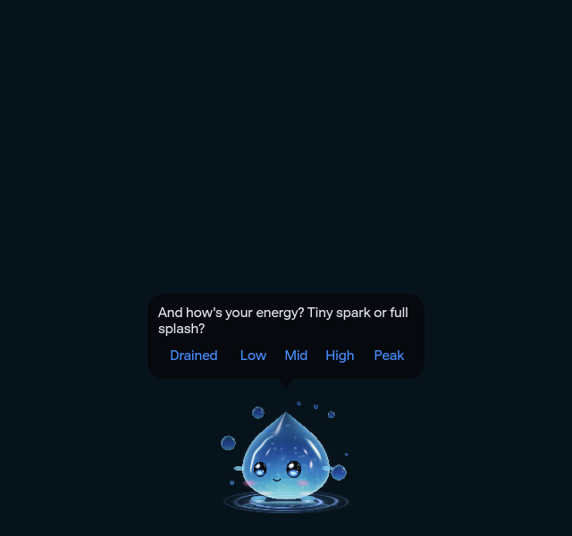
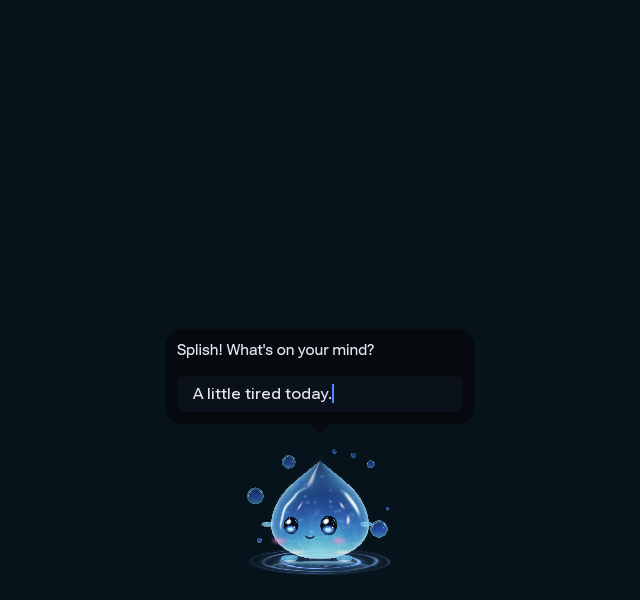

# Wull spatial motion — 2026-10-04

Installed runtime and exact canonical source: `8b2a0067ed1612770121d8896f46aa5b6db2216d`. This supersedes the [historical 27-action checkpoint](../alive-20261004/README.md). The [reference design](../../WULL_REFERENCE_DESIGN.md) maps the original concept to current rendering; all AI architecture/model/runtime/status work belongs only to the [canonical AI plan](../../../to-do/cloud-bot/WULL_LOCAL_AI.md).

The character now rotates **the actual implicit 3D liquid volume** in pitch, yaw and roll before ray intersection, refraction and lighting. Its face matrix, two hands, two feet and eight orbiting bubbles use the same pose. Depth compensates for subtle width/height deformation, preserving volume. Backside landing, faceplant and ice tilt the round body in space instead of flattening a 2D torso. Upright poses retain the analytic front path; tilted front search is bounded to 24/32/40 samples by rendering tier. No extra production pass, texture, animation clock, window or process was added.

This owned OpenGL board samples 61 frames at 100 ms. It uses the committed Blender curves and liquid shader with controlled shared-field water uniforms. It captures only its own item with isolated settings. Capture/encoding timing is not desktop frame pacing, and these images are evidence rather than runtime art. [Round falls](round-falls.png), [higher launch](higher-launch.png) and [slow quicksand](slow-quicksand.png) retain original captured pixels. [Artifact identities](artifacts.json) pin the source, helpers and images.

The editable saved Blender scene contains **29 actions, 1,332 exact keys, two hands/two feet/eight bubbles**. All limbs share the body parent. [Reopened-scene readback](blender-readback.json) checks 174 actual evaluated spatial poses: maximum matrix error `5.960464477539063e-08`, maximum volume determinant error `1.1920928955078125e-07`. Curve interpolation uses a per-key bound derived from Blender's float32 timing/value precision. Runtime reads the 30,958-byte scalar export; it never loads Blender, the authoring mesh or animation frames.

RiseJump/Launch reach about **83/108 native pixels**, with closed eyes/flailing for launch, stuck pushes and a distinct seated landing. Sink lasts **5,600 ms** and its shared-field depression/ripple lasts **5,800 ms**. FallVanish and an occasional icy backside landing/retry diversify exits. Complete clearance remains authoritative. Normal automatic hide waits until **eight seconds after full reveal**; intentional peek-only withdrawal and immediate policy hide remain separate. Unsupported float-up offers are reduced to 3%, with supported walk/run and transit flight retained. Walk16/run32/fly105, four-rim orientation, balance/carry, nearby reactions and mature-popup ownership remain.

The speech UI presents **one Mood question/row, then one Energy question/row**. Neither has a prompt input or extra action buttons. **Super + Alt + Comma** toggles the explicit chat editor, Enter sends and Escape cancels/dismisses; passive questions never take keyboard focus. Drafts survive closing. These captures use built-in fixture speech and contain no user journal/event text:

| Mood | Energy | Explicit chat |
| --- | --- | --- |
|  |  |  |

[Canonical validation](validation.json) is **PASS on exactly `8b2a0067ed1612770121d8896f46aa5b6db2216d`: 418 PASS / zero FAIL / eleven SKIP**, including **all 89 Wull Python checks**, Qt 6.11.2 parser and a clean validator source tree. Actual owned-GPU volume checks render standing/backside/faceplant/ice areas `[48184,47029,48723,49960]` at alpha >=128, validate round silhouettes and actual QML face projection. Behavioral tests cover the minimum visit deadline, slower exit, four-rim gaze/input, supported movement, shared-water coupling, carry/balance, nearby/shake/peek and curiosity handoff. The preceding [fa84b0e20 run](preceding-validation.json) remains **FAIL: 414/3/11**, with two stale explicit-focus expectations and the presence fixture's old hide deadlines. Test-only repair `1bead8100` corrected those fixtures without reverting production behavior.

[Preceding deployment](preceding-runtime-deployment.json) applies 23 owned runtime files at `fa84b0e20`; [spatial deployment](spatial-deployment.json) applies nine baseline-checked runtime files at the current source. The spatial upgrade preserves the user's config byte-for-byte. [Native live readback](live-readback.json) has one companion daemon, a ready backend and presented/valid field/scene/actor. Explicit chat IPC opens/closes successfully; Niri accepts the configured hotkey. Physical hotkey/pointer input is not certified by the synthetic Qt and IPC checks.

The original close-up was reopened and compared. This renderer retains roundness, reflections, colored liquid detail and slight translucency; the concept's city lighting, richer highlights and contact reflection still differ. **100% likeness, full-image lossless parity and measured CPU/GPU/RAM savings remain unqualified.** Native multi-output/hotplug/suspend/fractional-scaling and physical feature interaction remain separate acceptance. Existing defaults and all unrelated user preferences are preserved.
